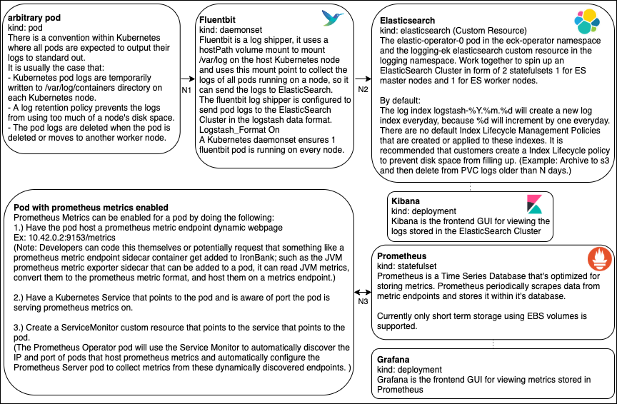

Goals of this Diagram: 
* Help new users understand the data flow of pod logs
* Help new users understand the data flow of prometheus metrics

| Line Number | Protocol | Port | Description |
| --- |  --- | --- | --- |
| N1 | Volume Mount | NA | Fluentbit reads pod logs from a host node volume mount |
| N2 | HTTPS | TCP:9200 | Fluentbit sends logs to Elastic Search over the URL: https://logging-ek-es-http:9200
(This URL is only exposed over the Kubernetes Inner Cluster Network, and because Fluentbit and ElasticSearch have Istio Envoy Proxy sidecar containers the network traffic is protected by the service mesh.) |
| N3 | HTTP | varies* | *A standard port number for prometheus metric endpoint URLs doesn't exist.
The Prometheus Operator is able to use ServiceMonitors and Kubernetes Services to automatically discover IP addresses of pods and these varying prometheus metric endpoint ports. Once a minute the prometheus Operator dynamically regenerates a metric collection config file that the Prometheus Server continuously uses to collect metrics. In the majority of cases prometheus metric endpoints, are read over HTTP, and are only reachable over the Kubernetes Inner Cluster Network.  |
