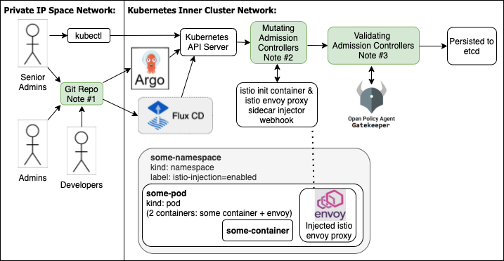

# Goals of this Architecture Diagram: 
* Help new users understand how BigBang extends the kube-apiserver using webhooks to enable:
  * Best practice security controls 
  * Abstractions that improve user experience for developers / maintainability
* Kubernetes Security Best Practice (per kube-bench) for requests to the kube-apiserver is that requests should go through the following flow of controls: 
  1. mTLS Authentication via x509 certs:    
     * This is baked into Kubernetes
  2. RBAC Authorization of users and Node Authentication for worker nodes    
     * `--authorization-mode=Node,RBAC` flag on kube-apiserver ensures this is set.
     * Deployed applications contain YAML manifests with rbac rules to minimize the rights of the application's service account.
  3. Admission Controllers: These take effect after Authn and Authz have occurred and allow the functionality of the api-server to be extended to enable additional security controls and advanced features. 
     * There are apiserver plugins baked into Kubernetes that just need to be turned on like `--enable-admission-plugins=NodeRestriction` per kube-bench.
     * There's also webhooks that allow extending the apiserver with custom logic, this will be overviewed in the diagram below. 

# BigBang Kuberenetes API Server Webhooks Diagram:

## Notes:  
### 1. Git Repo:  
* Can be HTTPS or SSH based, can exist on the Internet or in Private IP Space
* Airgap deployments are recommended to use SSH based Git Repo in Private IP Space
* Argo CD / Flux CD need network connectivity to and in most cases read only credentials to view the contents of the git repo.

### 2. Mutating Admission Controllers
* This improves user experience for developers. If a namespace is labeled `isito-injection=enabled`, then a developer can submit a YAML manifest where the pod only needs to reference 1 container image/the application. After the request is authenticated and authorized against the kube-apiserver, it's admission controller will see a mutating admission webhook exists and the manifest will be sent to the istiod pod in the istio-system namespace to mutate the manifest and inject an istio init container and istio envoy proxy sidecar container into the YAML manifest. This allows the developer's pod to be integrated into the service mesh with minimal configuration / effort on their part/no adjustments to their YAMLs were needed. 
* Note: It's possible to use Istio CNI Plugin to eliminate the need for Istio Init Containers.

### 3. Validating Admission Controllers
* Open Policy Agent Gatekeeper and Twistlock can be used as Validating Admission Controls.
* As of BigBang 1.7.0 OPA GK defaults to dryrun/warn and not blocking/enforcing mode,  [there are plans to change the default behavior to blocking/enforcing mode.](https://repo1.dso.mil/platform-one/big-bang/bigbang/-/issues/468) 
* OPA GK can enforce security policy such as only allowing whitelisted container registries, PodSecurityPolicies equivalent functionality, and more. 
* Twistlock Validating Admission is disabled by default as it requires a license, it can add additional security controls. 
